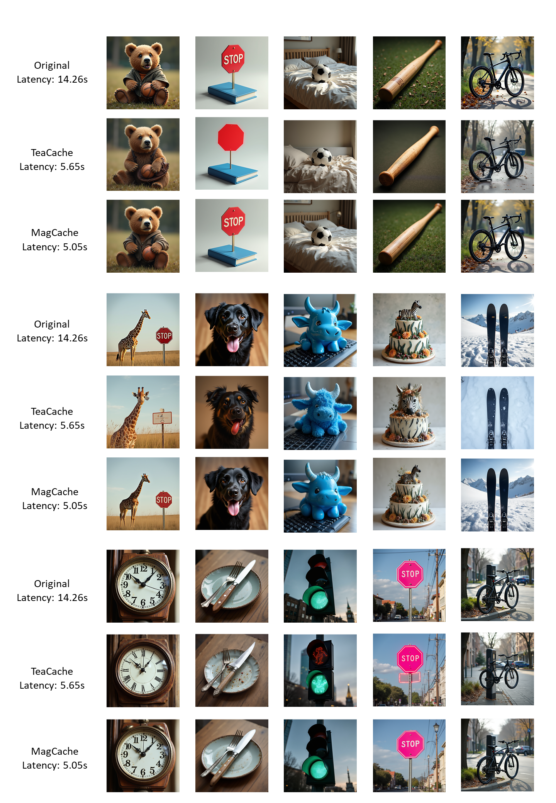

<!-- ## **MagCache4FLUX** -->
# MagCache4FLUX

[MagCache](https://github.com/Zehong-Ma/MagCache) can speedup [FLUX](https://github.com/black-forest-labs/flux) 2.8x without much visual quality degradation, in a training-free manner.



## 📈 Inference Latency Comparisons on a Single A800


|      FLUX.1 [dev]       |        TeaCache (0.6)       |    MagCache (E024K5R01)  |   
|:-----------------------:|:----------------------------:|:--------------------:|
|         ~14.26 s           |        ~5.65 s <br> 2.5x sppedup           |     ~5.05 s  <br> <b>2.8x</b> sppedup          |

<div class="content has-text-centered">
  <br>
</div>
<div class="content has-text-centered">
  <br>
</div>
<details style="width: 100%; margin: auto;">
<summary>Prompt: A photo of a black bicycle.</summary>
Prompt: A photo of a black bicycle.
</details>

## Installation

```shell
pip install --upgrade diffusers[torch] transformers protobuf tokenizers sentencepiece
```

## Usage

You can modify the '`magcache_thresh`', '`magcache_K`', and '`retention_ratio`' in lines 455-457 to obtain your desired trade-off between latency and visul quality. For single-gpu inference, you can use the following command:

```bash
python magcache_flux.py
```

## Citation
If you find MagCache is useful in your research or applications, please consider giving us a star 🌟 and citing it by the following BibTeX entry.

```
@misc{ma2025magcachefastvideogeneration,
      title={MagCache: Fast Video Generation with Magnitude-Aware Cache}, 
      author={Zehong Ma and Longhui Wei and Feng Wang and Shiliang Zhang and Qi Tian},
      year={2025},
      eprint={2506.09045},
      archivePrefix={arXiv},
      primaryClass={cs.CV},
      url={https://arxiv.org/abs/2506.09045}, 
}
```

## Acknowledgements

We would like to thank the contributors to the [FLUX](https://github.com/black-forest-labs/flux), [TeaCache](https://github.com/ali-vilab/TeaCache), and [Diffusers](https://github.com/huggingface/diffusers).