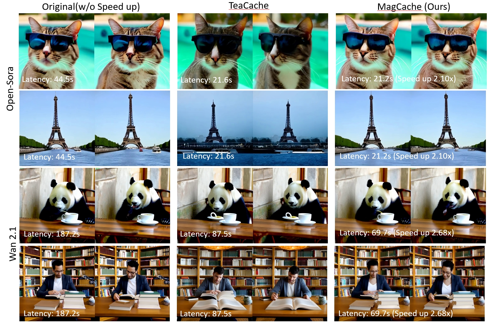
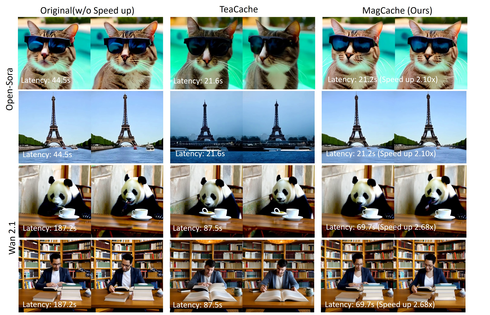
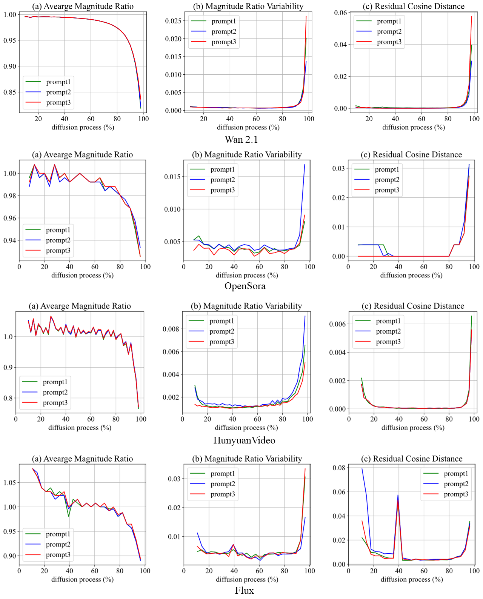
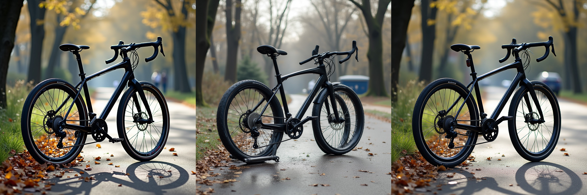

# MagCache: Fast Video Generation with Magnitude-Aware Cache

<div class="is-size-5 publication-authors", align="center",>
  <span class="author-block">
    <a href="https://zehong-ma.github.io/" target="_blank">Zehong Ma</a><sup>1,2</sup><sup>†</sup>,&nbsp;
  </span>
  <span class="author-block">
    <a href="https://joinwei-pku.github.io/longhuiwei.github.io/" target="_blank">Longhui Wei</a><sup>2</sup><sup>‡</sup>,&nbsp;
  </span>
  <span class="author-block">
    <a href="https://scholar.google.com/citations?user=bKG4Un8AAAAJ&hl=zh-CN" target="_blank">Feng Wang</a><sup>2</sup>,&nbsp;
  </span>
  <span class="author-block">
    <a href="https://www.pkuvmc.com/" target="_blank">Shiliang Zhang</a><sup>1</sup><sup>*</sup>,&nbsp;
  </span>
  <span class="author-block">
    <a href="https://www.qitian1987.com/" target="_blank">Qi Tian</a><sup>2</sup><sup>*</sup>
  </span>
</div>

<div class="is-size-5 publication-authors", align="center",>
  <span class="author-block"><sup>1</sup>State Key Laboratory of Multimedia Information Processing, <br>School of Computer Science, Peking University,&nbsp;</span>
  <span class="author-block"><sup>2</sup>Huawei Inc.</span>
</div>


<div class="is-size-5 publication-authors", align="center",>
  († Work was done during internship at Huawei Inc., ‡ Project Leader. * Corresponding author.)
</div>

<h5 align="center">

<!-- [](---) -->
[](https://arxiv.org/abs/2506.09045) 
[](https://zehong-ma.github.io/MagCache/) 
[](./LICENSE) 
[](https://github.com/Zehong-Ma/MagCache/)

</h5>


<!--  -->
<div class="content has-text-centered">
          <br>
          <span style="font-size: 0.8em; width: 100%; display: inline-block;">Figure 1: Visualization of MagCache on Open-Sora and Wan2.1. MagCache can achieve better visual quality with a comparable or less latency. More demos are shown in the subfolders of each model.</span>
        </div>

## 🫖 Introduction 
We introduce Magnitude-aware Cache (MagCache), a training-free caching approach that estimates and leverages the fluctuating differences among model outputs across timesteps based on the robust magnitude observations, thereby accelerating the inference. MagCache works well for Video Diffusion Models, Image Diffusion models. For more details and results, please visit our [project page](https://zehong-ma.github.io/MagCache/).

<div class="content has-text-centered">
            <br>
            <span style="font-size: 0.8em; width: 100%; display: inline-block;">Figure 2: Relationships between output residuals across diffusion timesteps. Magnitude ratio serves as both an accurate and stable criterion for measuring the difference between residuals.</span>
          </div>

## 🔥 Latest News 
- **If you like our project, please give us a star ⭐ on GitHub for the latest update.**

- [2025/6/10] 🔥 Support [Wan2.1](https://github.com/Wan-Video/Wan2.1), [HunyuanVideo](https://github.com/Tencent/HunyuanVideo), [FLUX](https://github.com/black-forest-labs/flux), [Open-Sora](https://github.com/hpcaitech/Open-Sora).
- [2025/6/10] 🎉 Release the [code](https://github.com/Zehong-Ma/MagCache) of MagCache.
- [2025/6/10] 🎉 Release the [paper](https://arxiv.org/abs/2506.09045) of MagCache.

## 🧩 Community Contributions  
If you develop/use MagCache in your projects and you would like more people to see it, please inform us.(zehongma@stu.pku.edu.cn)
  
## 🎉 Supported Models 
**Text to Video**
- [MagCache4Wan2.1](./MagCache4Wan2.1/README.md)
- [MagCache4HunyuanVideo](./MagCache4HunyuanVideo/README.md)
- [MagCache4Open-Sora](./eval/MagCache/README.md)

 **Image to Video** 
- [MagCache4Wan2.1](./MagCache4Wan2.1/README.md)

 **Text to Image**
- [MagCache4FLUX](./MagCache4FLUX/README.md)
<!-- - [MagCache4FLUX-schnell](./MagCache4FLUX_schnell/README.md) -->

 **Demos**
- **HunyuanVideo T2V 720P**

<!-- <table style="width:100%; margin: auto; text-align:center; font-size:0.7em;">
  <tr>
    <td>HunyuanVideo T2V (54min05s)</td>
    <td>TeaCache (23min49s)<br>PSNR: 22.80, 2.3x speedup</td>
    <td>MagCache (19min33s)<br>PSNR: 26.76, <b>2.8x</b> speedup</td>
  </tr>
</table> -->
<div align="center">
  <video src="https://github.com/user-attachments/assets/a815048a-b25b-4c4a-8742-6c19ab572fbb" width="100%" poster=""> </video>
</div>
<div class="content has-text-centered">
  <br>
</div>
<details style="width: 100%; margin: auto;">
<summary>Prompt: The video shows two astronauts in bulky suits walking slowly on the moon’s surface....</summary>
The video shows two astronauts in bulky suits walking slowly on the moon’s surface, against a vast starry universe. Their steps are heavy and slow, kicking up dust in the low-gravity environment. The scene is silent, mysterious, and evokes the courage and dreams of space exploration.
</details>

- **Wan2.1 14B I2V 720P**
<!-- 
<table style="width:100%; text-align:center; font-size:0.7em;">
  <tr>
    <td>Wan2.1 14B I2V (30min40s)</td>
    <td>TeaCache (13min04s)<br>PSNR: 13.67, 2.3x speedup</td>
    <td>MagCache (10min03s)<br>PSNR: 23.67, <b>3.0x</b> speedup</td>
  </tr>
</table> -->
<div align="center">
  <video src="https://github.com/user-attachments/assets/98c03bad-59ac-4d7f-bd43-7792c60ac957" width="100%" poster=""> </video>
</div>
<div class="content has-text-centered">
  <br>
</div>
<details style="width: 100%; margin: auto;">
<summary>Prompt: A woman in black lace stands confidently in a dim Art Deco interior with polished marble floors....</summary>
A woman in black lace stands confidently in a dim Art Deco interior with polished marble floors. Stark chiaroscuro lighting highlights her sharp features as she tilts her head, crimson lips parting in a knowing smile. Her smoldering gaze meets the viewer while she turns gracefully, lace casting shifting shadows on the walls. A medium shot with a subtle dolly zoom, framed by velvet drapes, adds depth. The mysterious, refined atmosphere blends modern elegance with vintage Hollywood glamour, rendered in 8K hyper-realistic detail, metallic gold accents glowing in the soft light.
</details>


- **Wan2.1 14B T2V 720P**

<!-- <table style="width:100%; text-align:center; font-size:0.7em;">
  <tr>
    <td>Wan2.1 14B T2V (60min04s)</td>
    <td>TeaCache (30min01s) <br> PSNR: 17.39, 2.0x speedup</td>
    <td>MagCache (21min40s) <br> PSNR: 24.39, <b>2.8x</b> speedup</td>
  </tr>
</table> -->
<div align="center">
  <video src="https://github.com/user-attachments/assets/39dd52b8-3b45-4c87-b6fd-df979c0d062c" width="100%" poster=""> </video>
</div>
<div class="content has-text-centered">
  <br>
</div>
<details style="width: 100%; margin: auto;">
<summary>Prompt: The video shows two astronauts in bulky suits walking slowly on the moon’s surface....</summary>
The video shows two astronauts in bulky suits walking slowly on the moon’s surface, against a vast starry universe. Their steps are heavy and slow, kicking up dust in the low-gravity environment. The scene is silent, mysterious, and evokes the courage and dreams of space exploration.
</details>

<!-- <table style="width:100%; text-align:center; font-size:0.7em;">
  <tr>
    <td>Wan2.1 14B T2V (60min04s)</td>
    <td>TeaCache (30min01s), <br> PSNR: 14.32, 2.0x speedup</td>
    <td>MagCache (21min40s), <br> PSNR: 21.82, <b>2.8x</b> speedup</td>
  </tr>
</table> -->
<div align="center">
  <video src="https://github.com/user-attachments/assets/0d074cc7-7d94-4a86-b1a1-2160b3ef9dd1" width="100%" poster=""> </video>
</div>
<div class="content has-text-centered">
  <br>
</div>
<details style="width: 100%; margin: auto;">
<summary>Prompt: A stylish woman walks down a Tokyo street filled with warm glowing neon....</summary>
A stylish woman walks down a Tokyo street filled with warm glowing neon and animated city signage. She wears a black leather jacket, a long red dress, and black boots, and carries a black purse. She wears sunglasses and red lipstick. She walks confidently and casually. The street is damp and reflective, creating a mirror effect of the colorful lights. Many pedestrians walk about.
</details>

- **Wan2.1 1.3B T2V 480P**

<!-- <table style="width:100%; text-align:center; font-size:0.7em;">
  <tr>
    <td>Wan2.1 1.3B T2V (189s)</td>
    <td>TeaCache (95s) <br> PSNR: 14.86, 2.0x speedup</td>
    <td>MagCache (87s) <br> PRNR: 20.51, 2.2x speedup</td>
    <td>MagCache (68s) <br> PSNR: 18.93, <b>2.8x</b> speedup</td>
  </tr>
</table> -->
<div align="center">
  <video src="https://github.com/user-attachments/assets/5e0999a2-d959-4bbc-9c89-e06e303b7047" width="100%" poster=""> </video>
</div>
<div class="content has-text-centered">
  <br>
</div>
<details style="width: 100%; margin: auto;">
<summary>Prompt: Two anthropomorphic cats in comfy boxing gear and bright gloves fight intensely on a spotlighted stage.</summary>
Prompt: Two anthropomorphic cats in comfy boxing gear and bright gloves fight intensely on a spotlighted stage.
</details>

<!-- <table style="width:100%; text-align:center; font-size:0.7em;">
  <tr>
    <td>OpenSora T2V (44.56s)</td>
    <td>TeaCache (21.67s)<br>PSNR: 20.51, 2.1x speedup</td>
    <td>MagCache (16.86s)<br>PSNR: 26.82, <b>2.6x</b> speedup</td>
  </tr>
</table> -->
<div align="center">
  <video src="https://github.com/user-attachments/assets/fbb444db-320e-4108-9410-9e36cd6b0b0e" width="100%" poster=""> </video>
</div>
<div class="content has-text-centered">
  <br>
</div>
<details style="width: 100%; margin: auto;">
<summary>Prompt: A tranquil tableau of an ornate Victorian streetlamp....</summary>
A tranquil tableau of an ornate Victorian streetlamp standing on a cobblestone street corner, illuminating the empty night
</details>


- **FLUX-dev T2I**

<!-- <table style="width:100%; text-align:center; font-size:0.7em;">
  <tr>
    <td>FLUX-dev (14.26s)</td>
    <td>TeaCache (5.65s), <br> 2.5x sppedup</td>
    <td>MagCache (5.05s), <br> <b>2.8x</b> sppedup</td>
  </tr>
</table> -->
<div class="content has-text-centered">
  <br>
</div>
<div class="content has-text-centered">
  <br>
</div>
<details style="width: 100%; margin: auto;">
<summary>Prompt: A photo of a black bicycle.</summary>
Prompt: A photo of a black bicycle.
</details>

## 🤖 Instructions for Supporting Other Models 
- **Welcome for PRs to support other models.**
- Please implement the `magcache_calibration` function by referring the code in [MagCache4Wan2.1](./MagCache4Wan2.1/magcache_generate.py)
- Utilize a random prompt or input to generate the magnitude ratio.
- Implement the `magcache_forward` function by adding a few lines into the original forward function.
- Reuse the default hyper-parameters or set your own hyper-parameters to achieve a trade-off between latency and quality.

## 💐 Acknowledgement 

This repository is built based on [VideoSys](https://github.com/NUS-HPC-AI-Lab/VideoSys), [Diffusers](https://github.com/huggingface/diffusers), [Open-Sora](https://github.com/hpcaitech/Open-Sora), [FLUX](https://github.com/black-forest-labs/flux), [Wan2.1](https://github.com/Wan-Video/Wan2.1), [HunyuanVideo](https://github.com/Tencent/HunyuanVideo), and [TeaCache](https://github.com/ali-vilab/TeaCache). Thanks for their contributions!

## 🔒 License 

* The core code of this project is released under the Apache 2.0 license as found in the [LICENSE](./LICENSE) file. The core code includes the calibration and forward code of MagCache.
* For [VideoSys](https://github.com/NUS-HPC-AI-Lab/VideoSys), [TeaCache](https://github.com/ali-vilab/TeaCache), [Diffusers](https://github.com/huggingface/diffusers), [Open-Sora](https://github.com/hpcaitech/Open-Sora), [HunyuanVideo](https://github.com/Tencent/HunyuanVideo), [FLUX](https://github.com/black-forest-labs/flux), and [Wan2.1](https://github.com/Wan-Video/Wan2.1) please follow their LICENSE.

## 📖 Citation 
If you find MagCache is useful in your research or applications, please consider giving us a star ⭐ and citing it by the following BibTeX entry.

```
@misc{ma2025magcachefastvideogeneration,
      title={MagCache: Fast Video Generation with Magnitude-Aware Cache}, 
      author={Zehong Ma and Longhui Wei and Feng Wang and Shiliang Zhang and Qi Tian},
      year={2025},
      eprint={2506.09045},
      archivePrefix={arXiv},
      primaryClass={cs.CV},
      url={https://arxiv.org/abs/2506.09045}, 
}
```


