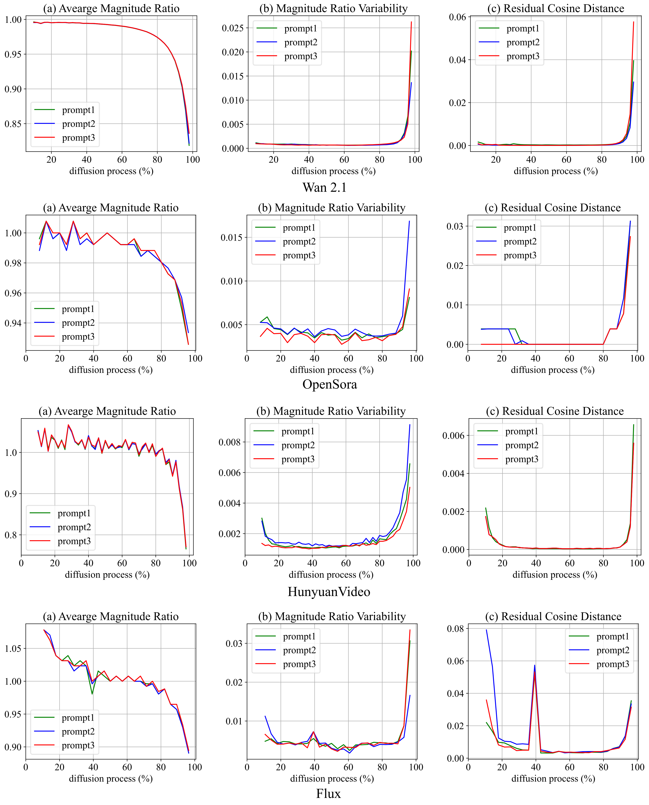

# MagCache: Fast Video Generation with Magnitude-Aware Cache

<div class="is-size-5 publication-authors">
            <span class="author-block">
              <a href="https://zehong-ma.github.io/" target="_blank">Zehong Ma</a><sup>1,2</sup><sup>†</sup>,&nbsp;
            </span>
            <span class="author-block">
              <a href="https://joinwei-pku.github.io/longhuiwei.github.io/" target="_blank">Longhui Wei</a><sup>2</sup><sup>‡</sup>,&nbsp;
            </span>
            <span class="author-block">
              <a href="https://scholar.google.com/citations?user=bKG4Un8AAAAJ&hl=zh-CN" target="_blank">Feng Wang</a><sup>2</sup>,&nbsp;
            </span>
            <span class="author-block">
              <a href="https://www.pkuvmc.com/" target="_blank">Shiliang Zhang</a><sup>1</sup><sup>*</sup>,&nbsp;
            </span>
            <span class="author-block">
              <a href="https://www.qitian1987.com/" target="_blank">Qi Tian</a><sup>2</sup><sup>*</sup>
            </span>
          </div>

  <div class="is-size-5 publication-authors">
    <span class="author-block"><sup>1</sup>Peking University,&nbsp;</span>
    <span class="author-block"><sup>2</sup>Huawei Inc.</span>
  </div>


  <div class="is-size-5 publication-authors">
    († Work was done during internship at Huawei Inc., ‡ Project Leader. * Corresponding author.)
  </div>

<h5 align="center">

<!-- [](---) -->
<!-- [](---)  -->
[](https://zehong-ma.github.io/MagCache/) 
[](./LICENSE) 
[](https://github.com/Zehong-Ma/MagCache/)

</h5>


<!--  -->
<div class="content has-text-centered">
          <br>
          <span style="font-size: 0.8em; width: 100%; display: inline-block;">Figure 1: Visualization of MagCache on Open-Sora and Wan2.1. MagCache can achieve better visual quality with a comparable or less latency. More demos are shown in the subfolders of each model.</span>
        </div>

## 🫖 Introduction 
We introduce Magnitude-aware Cache (MagCache), a training-free caching approach that estimates and leverages the fluctuating differences among model outputs across timesteps based on the robust magnitude observations, thereby accelerating the inference. MagCache works well for Video Diffusion Models, Image Diffusion models. For more details and results, please visit our [project page](https://zehong-ma.github.io/MagCache/).

<div class="content has-text-centered">
            <br>
            <span style="font-size: 0.8em; width: 100%; display: inline-block;">Figure 2: Relationships between output residuals across diffusion timesteps. Magnitude ratio serves as both an accurate and stable criterion for measuring the difference between residuals.</span>
          </div>

## 🔥 Latest News 
- **If you like our project, please give us a star ⭐ on GitHub for the latest update.**

- [2025/6/10] 🔥 Support [Wan2.1](https://github.com/Wan-Video/Wan2.1), [HunyuanVideo](https://github.com/Tencent/HunyuanVideo), [FLUX](https://github.com/black-forest-labs/flux), [Open-Sora](https://github.com/hpcaitech/Open-Sora).
- [2025/6/10] 🎉 Release the [code](https://github.com/LiewFeng/MagCache) of MagCache.
- [2025/6/10] 🎉 Release the [paper](https://arxiv.org/abs/2411.19108) of MagCache.

## 🧩 Community Contributions  
If you develop/use MagCache in your projects and you would like more people to see it, please inform us.(zehongma@stu.pku.edu.cn)
  
## 🎉 Supported Models 
**Text to Video**
- [MagCache4Wan2.1](./MagCache4Wan2.1/README.md)
- [MagCache4HunyuanVideo](./MagCache4HunyuanVideo/README.md)
- [MagCache4Open-Sora](./eval/MagCache/README.md)

 **Image to Video** 
- [MagCache4Wan2.1](./MagCache4Wan2.1/README.md)

 **Text to Image**
- [MagCache4FLUX](./MagCache4FLUX/README.md)
- [MagCache4FLUX-schnell](./MagCache4FLUX_schnell/README.md)

 **Demos**

- **Wan2.1 14B T2V, 5s, 720P.**
  <div style="display: grid; grid-template-columns: repeat(3, 1fr); gap: 10px; place-items: center; font-size: 1.0em;">
    <div style="text-align: center;">Wan2.1 14B T2V (60min04s)</div>
    <div style="text-align: center;">TeaCache (30min01s) <br> PSNR: 17.39, 2.0x speedup</div>
    <div style="text-align: center;">MagCache (21min40s) <br> PSNR: 24.39, <b>2.8x</b> speedup</div>
  </div>
  <video class="video" autoplay controls muted loop playsinline>
    <source src="https://github.com/Zehong-Ma/MagCache/blob/main/docs/static/videos/Wan14B_t2v_two_astronauts.mp4" type="video/mp4">
  </video>
  <p align="center" style="font-size:1.25em; margin:0.5em 0;">
    Wan2.1 14B T2V, 5s, 720P.
  </p>
     
    <div style="display: grid; grid-template-columns: repeat(3, 1fr); gap: 10px; place-items: center; font-size: 1.0em;">
      <div style="text-align: center;">Wan2.1 14B T2V (60min04s)</div>
      <div style="text-align: center;">TeaCache (30min01s), <br> PSNR: 14.32, 2.0x speedup</div>
      <div style="text-align: center;">MagCache (21min40s), <br> PSNR: 21.82, <b>2.8x</b> speedup</div>
    </div>
    <video class="video" autoplay controls muted loop playsinline>
      <source src="https://github.com/Zehong-Ma/MagCache/blob/main/docs/static/videos/Wan14B_t2v_A_stylish_woman_Tokyo.mp4" type="video/mp4">
    </video>
    <span style="font-size: 1.5em; width: 100%; display: inline-block; text-align: center;">Wan2.1 14B T2V, 5s, 720P.</span>
    <br>
    <br>
    <br>
    <div style="display: grid; grid-template-columns: repeat(4, 1fr); gap: 10px; place-items: center; font-size: 1.0em;">
      <div style="text-align: center;">Wan2.1 1.3B T2V (189s)</div>
      <div style="text-align: center;">TeaCache (95s) <br> PSNR: 14.86, 2.0x speedup</div>
      <div style="text-align: center;">MagCache (87s) <br> PRNR: 20.51, 2.2x speedup</div>
      <div style="text-align: center;">MagCache (68s) <br> PSNR: 18.93, <b>2.8x</b> speedup</div>
    </div>
    <video class="video" autoplay controls muted loop playsinline>
      <source src="https://github.com/Zehong-Ma/MagCache/blob/main/docs/static/videos/Wan1.3B_t2v_two_cat.mp4" type="video/mp4">
    </video>
    <span style="font-size: 1.5em; width: 100%; display: inline-block; text-align: center;">Wan2.1 1.3B T2V, 5s, 480P.</span>
    <br>
    <br>
    <br>
    <div style="display: grid; grid-template-columns: repeat(3, 1fr); gap: 10px; place-items: center; font-size: 1.0em;">
      <div style="text-align: center;">Wan2.1 14B I2V (30min40s)</div>
      <div style="text-align: center;">TeaCache (13min04s) <br> PSNR: 13.67, 2.3x speedup</div>
      <div style="text-align: center;">MagCache (10min03s) <br> PSNR: 23.67, <b>3.0x</b> speedup</div>
      <!-- <div style="text-align: center;">MagCache (--) <br> PSNR: 22.58, 3.0x speedup</div> -->
    </div>
    <video class="video" autoplay controls muted loop playsinline>
      <source src="https://github.com/Zehong-Ma/MagCache/blob/main/docs/static/videos/Wan14B_i2v_720P_A_woman_in_black.mp4" type="video/mp4">
    </video>
    <span style="font-size: 1.5em; width: 100%; display: inline-block; text-align: center;">Wan2.1 I2V, 3s, 720P.</span>
    <br>
    <br>
    <br>
    <div style="display: grid; grid-template-columns: repeat(4, 1fr); gap: 10px; place-items: center; font-size: 1.0em;">
      <div style="text-align: center;">Wan2.1 14B I2V (13min20s)</div>
      <div style="text-align: center;">TeaCache (5min22s) <br> PSNR: 20.04, 2.5x speedup</div>
      <div style="text-align: center;">MagCache (4min43s) <br> PSNR: 25.38, 2.8x speedup</div>
      <div style="text-align: center;">MagCache (4min23s) <br> PSNR: 22.58, <b>3.0x</b> speedup</div>
    </div>
    <video class="video" autoplay controls muted loop playsinline>
      <source src="https://github.com/Zehong-Ma/MagCache/blob/main/docs/static/videos/Wan14B_i2v_480P_A_woman_in_black.mp4" type="video/mp4">
    </video>
    <span style="font-size: 1.5em; width: 100%; display: inline-block; text-align: center;">Wan2.1 I2V, 5s, 480P.</span>
    <br>
    <br>
    <br>
    <div style="display: grid; grid-template-columns: repeat(3, 1fr); gap: 10px; place-items: center; font-size: 1.0em;">
      <div style="text-align: center;">HunyuanVideo T2V (54min05s)</div>
      <div style="text-align: center;">TeaCache (23min49s) <br> PSNR: 22.80, 2.3x speedup</div>
      <div style="text-align: center;">MagCache (19min33s) <br> PSNR: 26.76, <b>2.8x</b> speedup</div>
    </div>
    <video class="video" autoplay controls muted loop playsinline>
      <source src="https://github.com/Zehong-Ma/MagCache/blob/main/docs/static/videos/HunyuanVideo_t2v_two_astronauts_three_col.mp4" type="video/mp4">
    </video>
    <span style="font-size: 1.5em; width: 100%; display: inline-block; text-align: center;">HunyuanVideo T2V, 5s, 720P.</span>
    <br>
    <br>
    <br>
    <div style="display: grid; grid-template-columns: repeat(3, 1fr); gap: 10px; place-items: center; font-size: 1.0em;">
      <div style="text-align: center;">HunyuanVideo T2V (20min10s)</div>
      <div style="text-align: center;">TeaCache (8min53s) <br> PSNR: 23.10, 2.3x speedup</div>
      <div style="text-align: center;">MagCache (7min17s) <br> PSNR: 29.22, <b>2.8x</b> speedup</div>
    </div>
    <video class="video" autoplay controls muted loop playsinline>
      <source src="https://github.com/Zehong-Ma/MagCache/blob/main/docs/static/videos/HunyuanVideo_t2v_a_couple_three.mp4" type="video/mp4">
    </video>
    <span style="font-size: 1.5em; width: 100%; display: inline-block; text-align: center;">HunyuanVideo T2V, 5s, 540P.</span>
    <br>
    <br>
    <br>
    <div style="display: grid; grid-template-columns: repeat(3, 1fr); gap: 10px; place-items: center; font-size: 1.0em;">
      <div style="text-align: center;">FLUX-dev (14.26s)</div>
      <div style="text-align: center;">TeaCache (5.65s), 2.5x</div>
      <div style="text-align: center;">MagCache (5.05s), 2.8x</div>
    </div>
    <div class="content has-text-centered">
      <br>
      <span style="font-size: 1.5em; width: 100%; display: inline-block; text-align: center;">FLUX-dev, bicycle.</span>
    </div>
    <br>
    <div style="display: grid; grid-template-columns: repeat(3, 1fr); gap: 10px; place-items: center; font-size: 1.0em;">
      <div style="text-align: center;">FLUX-dev (14.26s)</div>
      <div style="text-align: center;">TeaCache (5.65s), 2.5x</div>
      <div style="text-align: center;">MagCache (5.05s), 2.8x</div>
    </div>
    <div class="content has-text-centered">
      <br>
      <span style="font-size: 1.5em; width: 100%; display: inline-block; text-align: center;">FLUX-dev, clock.</span>
    </div>
    <br>
    <br>
    <br>

## 🤖 Instructions for Supporting Other Models 
- **Welcome for PRs to support other models.**
- Please implement the `magcache_calibration` function by referring the code in [MagCache4Wan2.1](./MagCache4Wan2.1/magcache_generate.py)
- Utilize a random prompt or input to generate the magnitude ratio.
- Implement the `magcache_forward` function by adding a few lines into the original forward function.
- Reuse the default hyper-parameters or set your own hyper-parameters to achieve a trade-off between latency and quality.

## 💐 Acknowledgement 

This repository is built based on [VideoSys](https://github.com/NUS-HPC-AI-Lab/VideoSys), [Diffusers](https://github.com/huggingface/diffusers), [Open-Sora](https://github.com/hpcaitech/Open-Sora), [FLUX](https://github.com/black-forest-labs/flux), [Wan2.1](https://github.com/Wan-Video/Wan2.1), [HunyuanVideo](https://github.com/Tencent/HunyuanVideo), and [TeaCache](https://github.com/ali-vilab/TeaCache). Thanks for their contributions!

## 🔒 License 

* The majority of this project is released under the Apache 2.0 license as found in the [LICENSE](./LICENSE) file.
* For [VideoSys](https://github.com/NUS-HPC-AI-Lab/VideoSys), [Diffusers](https://github.com/huggingface/diffusers), [Open-Sora](https://github.com/hpcaitech/Open-Sora), [HunyuanVideo](https://github.com/Tencent/HunyuanVideo), and [Wan2.1](https://github.com/Wan-Video/Wan2.1) please follow their LICENSE.

## 📖 Citation 
If you find MagCache is useful in your research or applications, please consider giving us a star ⭐ and citing it by the following BibTeX entry.

<!-- ```
@article{liu2024timestep,
  title={Timestep Embedding Tells: It's Time to Cache for Video Diffusion Model},
  author={Liu, Feng and Zhang, Shiwei and Wang, Xiaofeng and Wei, Yujie and Qiu, Haonan and Zhao, Yuzhong and Zhang, Yingya and Ye, Qixiang and Wan, Fang},
  journal={arXiv preprint arXiv:2411.19108},
  year={2024}
}
``` -->


